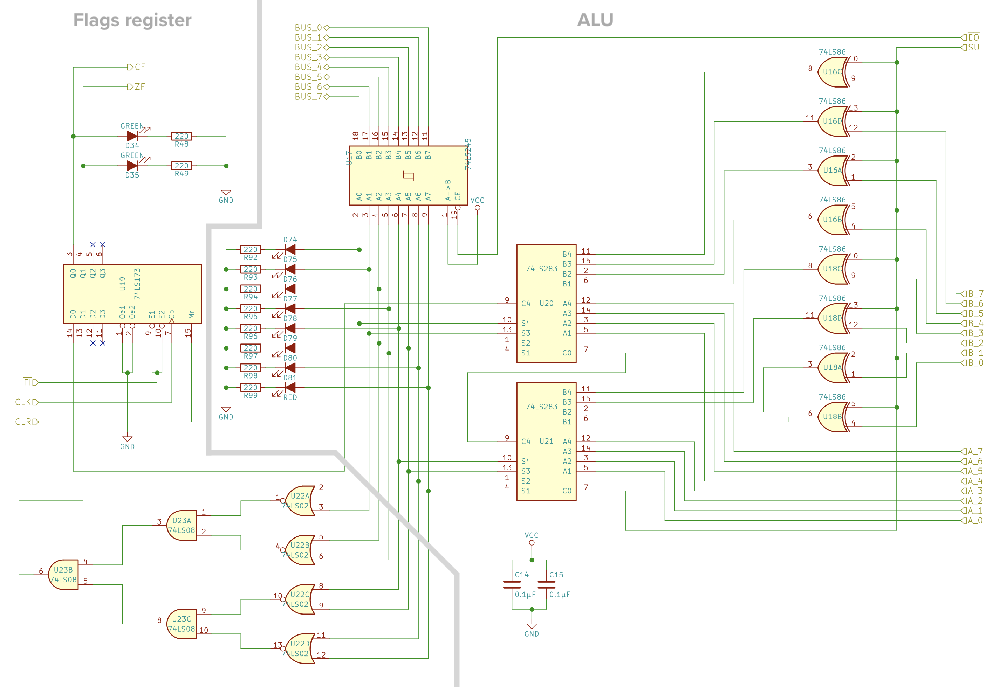

# Arithmetic logic unit (ALU)
The arithmetic logic unit (ALU) part of a CPU is usually capable of performing various arithmetic, bitwise, and comparison operations on binary numbers. In our simple breadboard CPU, the ALU is just able to add and subtract. It’s connected to the A and B registers and outputs either the sum of A+B or the difference of A-B.  

 

## Arithmetic logic unit (ALU) schematics

We will use the following circuit that is built up from basic logic gates to perform addition or subtraction (after getting two complements of subtrahend) on two bits.

### &nbsp;&nbsp;&nbsp;&nbsp; 1-bit adder

 

We will use 8 copies of the above circuit in cascade to perform addition and subtraction on 8-bit computer registers.

### &nbsp;&nbsp;&nbsp;&nbsp; 4-bit adder

 

### &nbsp;&nbsp;&nbsp;&nbsp; 8-bit adder

 