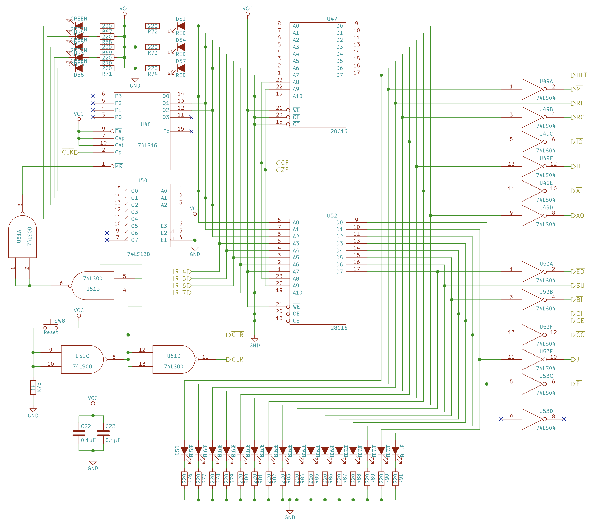

# CPU control logic
The control logic is the heart of the CPU. It’s what defines the opcodes the processor recognizes and what happens when it executes each instruction.  

 

## Program Counter schematics

Since we have created that computer from scratch, we need to configure how the address will be decoded to know which instruction to execute. So, we will use the 10 bits of the address as follows: 
<ul>
<li>Bit 0 to Bit 2: step counter</li>
<li>Bit 3 to Bit 6: instruction opcode (hard coded)</li>
<li>Bit 7: base selector (to select the EEPROM chip since the 2-byte instruction is stored in 2 EEPROM chips)</li>
<li>Bit 8 to Bit 9: flags status</li>
</ul>

### &nbsp;&nbsp;&nbsp;&nbsp; Address formating

 

The instruction formatting will be based on which control signals to be activated at a time. The following formatting will be very sufficient for our computer:

 

 

As the reset/enable signals of each module are directly connected to ground and VCC based on whether the chip is active low or active high, we could use the following circuit as a reset signal for all the chips in our 8-bit computer. Of course, each signal will be activated according to the decoding of the instruction.

### &nbsp;&nbsp;&nbsp;&nbsp; Centeral reset circuit

 

and we will use the following circuit for checking when the result of an arithmetic operation yields a zero.

### &nbsp;&nbsp;&nbsp;&nbsp; Zero flag circuit

 

Here is the final schematic for the 8-bit computer: 

 

The instruction and address decodes are stored in the EEPROM. You can find the EEPROM programmer schematic, Arduino code, and more by visiting the [EEPROM programmer](/EEPROM%20programmer/) section.