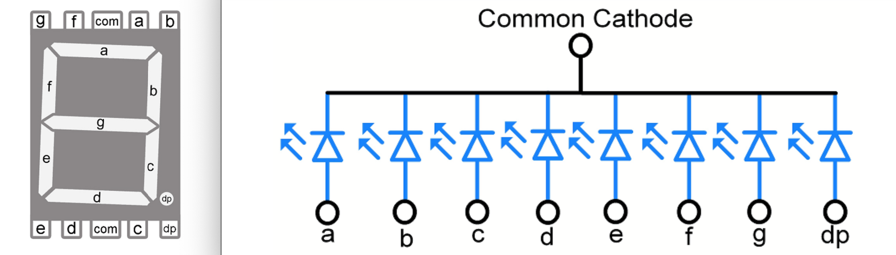

# Output register
The output register is similar to any other register (like the A and B registers) except rather than displaying its contents in binary on 8 LEDs, it displays its contents in decimal on a 7-segment display.  

 

We are using the EEPROM for programming the data to be printed on the 7-segments. 
We need to format the address in such a way that makes it easier to know which digit will be displayed on which segment. The following formatting will be sufficient: 
<ul>
<li>Bit 0 to Bit 7: the number to display </li>
<li>Bit 8 to Bit 9: the value of the binary counter (indicate which segment to use)</li>
<li>Bit 10: connected to low when displaying unsigned integers and connected to high when displaying signed integers. </li>
</ul>

 

We will use common cathode 7-segments for display purposes.

 

You can find the EEPROM programmer schematic, Arduino code, and more by visiting the [EEPROM programmer](/EEPROM%20programmer/) section.