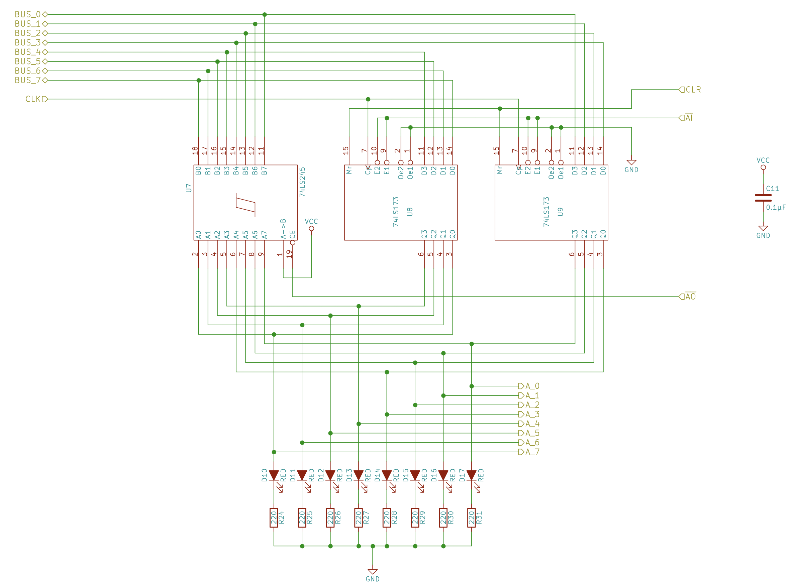

# Registers
Most CPUs have a number of registers that store small amounts of data that the CPU is processing. In our simple breadboard CPU, we’ll build three 8-bit registers: A, B, and IR. The A and B registers are general-purpose registers. IR (the instruction register) works similarly, but we’ll only use it for storing the current instruction that’s being executed.  

## Register schematics
### &nbsp;&nbsp;&nbsp;&nbsp;  1. Register A

  

### &nbsp;&nbsp;&nbsp;&nbsp; 2. Register B

  

### &nbsp;&nbsp;&nbsp;&nbsp; 3. Instruction Register

  

We will use the D flip-flop as the underlying logic circuit for storing data.
> The D flip flop is a digital electronic circuit used to delay the change of state of its output signal (Q) until the next rising edge of a clock timing input signal occurs.

The D FlipFlop can be interpreted as a delay line or zero-order hold. The advantage of the D flip-flop over the D-type "transparent latch" is that the signal on the D input pin is captured the moment the flip-flop is clocked, and subsequent changes on the D input will be ignored until the next clock event.

### D latch

  

### D latch timing diagram

  

from the timing diagram, we see that the output state (Q) is read whenever the enable signal is high, i.e, the D state (input of latch) is buffered to the Q state (output of the latch). Otherwise, the output state of the latch follows its previous state.
On the other hand, by using the D flip flop the enable state is read only once at the beginning of the next positive edge. Therefore, we will add the following logic circuit for the enable input to maintain its HIGH state to take the least amount of time.

### D flip flop enable logic circuit

  
The AND gate is used to give high output for a very small time as the output of the NOT gate is not inverting input instantaneously, i.e., some delay is incorporated. We could also utilize a very small capacitor that gives a high output while it charging. Afterward, The capacitor will start to give low output gradually while discharging.    

### D flip flop

  

### D flip flop timing diagram

  

As all registers are connected to the common bus, it is mandatory to add control lines for each register to select if a register is performing memory read or memory write to prevent the interference of data between registers, memory, and common bus. 

### Register control lines

  

The output lines of each register should be connected to the common bus to transfer data between registers and the commnon bus whenever the write signal of a register is activated. 

### Register control lines

  